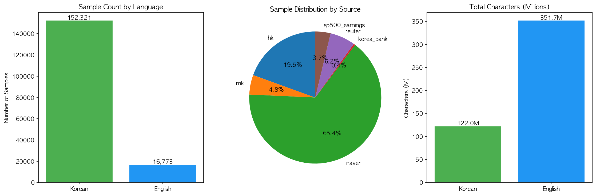

# 데이터셋 통계

## 요약
| 언어 | 샘플 수 | 총 글자 수 | 평균 길이 |
|------|--------:|----------:|--------:|
| 🇰🇷 한국어 | 152,323 | ~122M | 801 chars |
| 🇺🇸 영어 | 876,936 | ~700M | ~800 chars |
| **합계** | **1,029,259** | **~822M** | - |

## 소스별 상세

### 한국어
| 소스 | 샘플 수 | 설명 |
|------|--------:|------|
| naver | 110,604 | 네이버 금융 리서치 |
| hk | 32,954 | 한국경제 |
| mk | 8,108 | 매일경제 |
| korea_bank | 657 | 한국은행 용어사전 |

### 영어
| 소스 | 샘플 수 | 설명 |
|------|--------:|------|
| earnings_qa | 860,164 | Earnings Q&A 쌍 |
| reuter | 10,464 | Reuters 뉴스 |
| sp500_earnings | 6,308 | S&P500 Earnings Calls |

## 메타데이터 필드
```json
{
  "text": "본문",
  "language": "ko|en",
  "style_tag": "<|formal|>|<|casual|>",
  "metadata": {
    "source": "sp500_earnings",
    "event": "Q1 2024 Earnings Call",
    "company": "Apple Inc.",
    "ticker": "AAPL",
    "sector": "Technology"
  }
}
```

## 통계 시각화


## 생성일
2026-01-13 (v2 - 풍부한 메타데이터)
